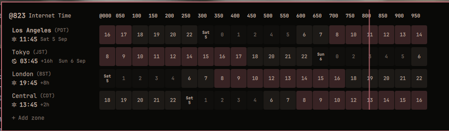

# Beat Time

[Swatch Internet Time](https://en.wikipedia.org/wiki/Swatch_Internet_Time)
for the [Omarchy](https://omarchy.org/) bar, with a popup that answers the
one question beats cannot: *is @330 the middle of the night or the middle of
the day for them?*

Internet Time divides the day into 1000 `.beats` of 86.4 seconds, counted
from midnight in Biel, Switzerland (UTC+1, no daylight saving). One beat is
the same everywhere, so there are no timezones to convert — but that also
means a beat carries no hint of whether anyone is awake. This widget puts
the beat in your bar and projects your zones onto the 1000-beat day so the
day/night cycle is visible at a glance.

Derived from Simon Späti's
[omarchy-timezones-plugin](https://github.com/sspaeti/omarchy-timezones-plugin)
(MIT). Beat math follows the canonical definition from the
[SwatchTime](https://github.com/swatchtime) organization.

## What you get

- **Bar pill**: the current beat, e.g. `@767`. Hover and it expands to each
  configured zone's local time with a day/night glyph, e.g.
  `󰖙 NY 07:12 · 󰖔 CDO 23:12`.
- **Popup** (right click): a 1000-beat ruler across the top, then one strip
  per zone. Each cell shows the local hour at that beat span, tinted by
  business hours (accent), waking hours (light), and night (dark). Where a
  zone's local midnight falls, the cell carries the new day's label. A line
  marks the current beat across every row.
- **Hover a beat** in the popup and every row's header switches to the local
  time at that beat — "@330 is 01:55 in New York, 07:55 in Biel".
- **Edit zones in the popup**: "+ Add zone" opens a searchable picker over
  every zone tzdata knows, rows drag to reorder, click a row's header to
  rename it, and a remove button appears at the right edge of the row under
  the cursor. All of it works from the keyboard too.

No network, no API: zone offsets and abbreviations come straight from the
system's tzdata (`TZ=<zone> date`), so summer/winter time is always
correct. Beats themselves need nothing but the system clock. The home row
follows the **system timezone**, so it updates when you travel.

Colors and fonts come from the active Omarchy theme, so it restyles on
`omarchy theme set <name>`.

Popup preview:


## Install

```sh
omarchy plugin add https://github.com/PongAlmighty/beat-time-revival.git --enable
```

## Usage

- **Hover** the beat: compact view of your zones' local times. With up to
  three rows in the popup the view sits still; more than that scroll
  through slowly, ticker style.
- **Right click**: open/close the beat grid (Escape also closes)
- **Hover a beat** in the popup: converts that beat across all zones
- **Middle click**: refresh timezone offsets
- **Left click**: unused, left to the bar and compositor

In the popup:

| Mouse | Keyboard | Does |
|---|---|---|
| hover a row | `j` / `k` | move the cursor |
| drag a row's header | `Shift+J` / `Shift+K`, `Shift+Down` / `Shift+Up` | move the row down / up |
| click a row's header | `Enter` | rename its label and short label |
| ✕ at the row's right edge | `x` | remove the zone (home never is) |
| "+ Add zone" | `a` | add a zone: pick it, adjust the label, `Enter` |
| | `Esc` | cancel an edit, or close the popup |

Changes are written straight back to the widget's entry in `shell.json`.
Scripts and keybindings can do the same over IPC:

```sh
omarchy-shell io.github.pongalmighty.beattime add              # open the popup on the picker
omarchy-shell io.github.pongalmighty.beattime addZone Asia/Tokyo
omarchy-shell io.github.pongalmighty.beattime removeZone Asia/Tokyo
omarchy bar set io.github.pongalmighty.beattime zones '[...]' --json   # replace the whole list
```

A zone added without a short label gets tzdata's abbreviation ("JST") when
it has a conventional one, else the first three letters of the city.

## Configure

Works out of the box: the home row is Omarchy's system timezone, plus US
East Coast and West Coast as example zones.

Configure the widget entry in `~/.config/omarchy/shell.json` (hot-reloads on
save). Example:

```json
{
  "id": "io.github.pongalmighty.beattime",
  "centibeats": false,
  "glyphs": true,
  "beatsPerCell": 50,
  "homeZones": ["America/Chicago"],
  "zones": [
    { "label": "Home", "shortLabel": "HOME", "zone": "", "home": true },
    { "label": "Biel", "shortLabel": "BMT", "zone": "Europe/Zurich" },
    { "label": "East Coast", "shortLabel": "NY", "zone": "America/New_York" },
    { "label": "Cagayan de Oro", "shortLabel": "CDO", "zone": "Asia/Manila", "abbr": "PHT" }
  ]
}
```

- `zones` — the rows of the popup, top to bottom.
  - `zone` — IANA timezone name; `""` with `"home": true` tracks the system timezone.
  - `label` — the location name shown in the popup.
  - `shortLabel` — used in the bar's hover view.
  - `abbr` — optional override for the timezone abbreviation shown in
    parentheses.
- `homeZones` — system timezones that keep the home row's configured label.
  Outside this list (traveling), the home row is relabeled by where the
  system clock actually is. Empty (default): always label by the system
  timezone.
- `centibeats` — show `@767.42` instead of `@767` in the bar. Default `false`.
- `glyphs` — show the day/night glyph (`󰖙` / `󰖔`) next to each zone in the
  bar hover view and popup. Default `true`.
- `beatsPerCell` — grid granularity: one of `25`, `40`, `50`, `100`, `125`,
  `200`. Default `50` (20 columns of 72 minutes). `40` gives 25 columns of
  roughly one hour each.
- `tickerZones` — how many popup rows, home included, the bar's hover view
  shows at rest. With more rows than this, the view stays as wide as the
  entries that fit under that count and the full list scrolls through it.
  Default `3`.
- `tickerSpeed` — ticker scroll speed in pixels per second. Default `22`.
- `icon` — optional glyph drawn before the beat in the bar. Default none.
- `hoverExpand` — set `false` to keep the bar pill static instead of
  expanding on hover. Default `true`.

Move it in the bar:

```sh
omarchy bar move io.github.pongalmighty.beattime --section center
```

## How the beat is computed

Following [swatchtime/sample-code](https://github.com/swatchtime/sample-code):

```
bielMs = (utcMs + 3600000) mod 86400000     // Biel = UTC+1, fixed
beats  = bielMs / 86400                     // 1 beat = 86.4 s
label  = "@" + zeroPad3(floor(beats))
```

The grid's column 0 is the most recent Biel midnight (23:00 UTC). A zone's
cell at column `c` is its local time at beat `c × beatsPerCell`. Centibeats
are rounded to two decimals *before* wrapping, so the display never flashes
`@1000.00`.

The only difference from the reference snippet is millisecond rather than
whole-second precision, so a beat turns over at exactly 86.4 s rather than
on the next whole second. The reference test vectors pass either way; see
`test/model.test.js` (`node --test test/`).

## What it runs and touches

No network, no daemon, no elevated privileges, no external packages.

- Reads the clock and tzdata through `date` and `timedatectl` (`TZ=<zone>
  date +'%z %Z'` per configured zone, `timedatectl list-timezones` for the
  picker). Zone names are validated against `[A-Za-z0-9_/+-]` before they
  reach a shell.
- Writes only the widget's own entry in `~/.config/omarchy/shell.json`, and
  only through the shell's `updateEntryInline` API, when you edit zones in
  the popup or over IPC. Nothing else in your configuration is touched.
- Runs inside the Omarchy shell process like every plugin, with your user's
  permissions.

## Remove

```sh
omarchy plugin remove io.github.pongalmighty.beattime
```

## License

MIT. See [LICENSE](LICENSE), which retains the original copyright notices.
